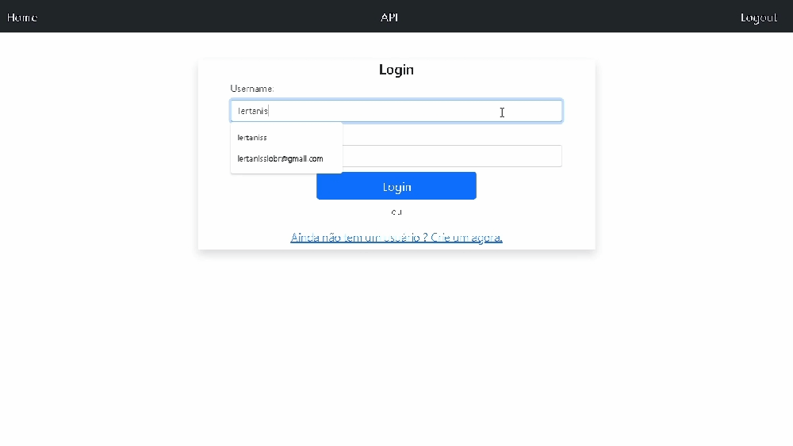

<h1 align="center">Todo List API</h1>

<p align="center">Este projeto é uma sistema web de lista de tarefas a fazer, ele foi feito em django, e contém uma api usando django rest framework</p>

<p align="center">
 <a href="#features">Features</a> •
 <a href="#pré-requisitos">Pré Requisitos</a> •
 <a href="#Executando a aplicação">Executando a aplicação</a> •
 <a href="#tecnologias">Tecnologias</a> •
 <a href="#autor">Autor</a>
</p>

---

<br>


<h1 align="center">
  
  

</h1>


### Features

- [x] API
- [x] Login
- [x] Lista de tarefas
- [x] Criar tarefas
- [x] Excluir tarefas
- [x] Editar tarefas
- [x] Search tarefas
- [x] DataTable


### Pré-requisitos

 Para executar esse projeto é necessario ter instalado na sua maquina o [Python 3](https://www.python.org/downloads/)
 e o [git](https://git-scm.com/)

### Executando a aplicação

```bash

# clone o projeto
$ git clone https://github.com/Hernandes-Silva/To-do-list-API
$ cd To-do-list-API

#acesse a pasta do projeto com o terminal/cmd e dê o comando:
$  pip install -r requirements.txt


#Agora faça as migrações
$ py manage.py migrate

#Por fim teste a instalação dando o comando
$ python manage.py runserver


```


### Tecnologias

As seguintes ferramentas foram usadas na construção do projeto:


- [Django](https://www.djangoproject.com/)
- [Django rest framework](https://www.django-rest-framework.org/)
- [DataTable](https://datatables.net/)
- [BootStrap](https://getbootstrap.com/docs/5.1/getting-started/introduction/)
- [GitHub](https://github.com/) 
- [Python3](https://www.python.org/downloads/)


---

### Autor
* [**Hernandes Matheus**](https://github.com/Hernandes-Silva)


## License

Este projeto está licenciado sob a Licença MIT - veja o arquivo [LICENSE.md](https://opensource.org/licenses/MIT) para detalhes.